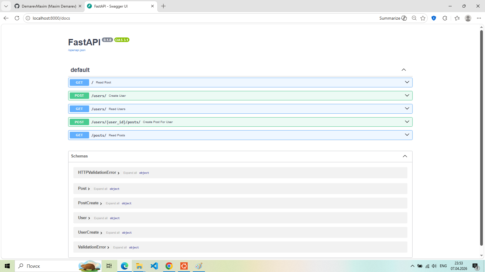

# Blog API (FastAPI + PostgreSQL + Docker)

REST API для блога с пользователями и постами.

## 🚀 Технологии

- FastAPI
- PostgreSQL
- SQLAlchemy
- Docker
- Docker Compose

## 📷 API Preview


---
## 📦 Возможности

- Создание пользователей
- Получение списка пользователей
- Создание постов
- Получение списка постов
- Связь пользователей и постов

## ▶️ Запуск проекта

```bash
docker compose up -d --build

